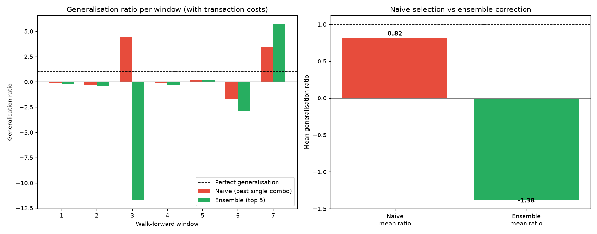
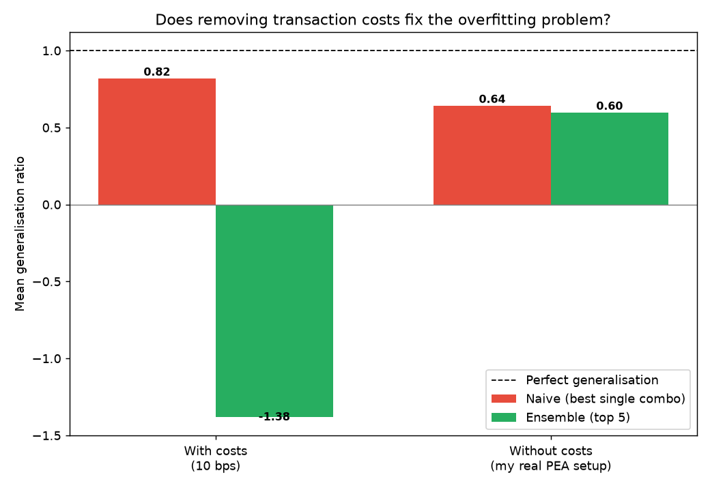

# The Overfitting Trap: Why a "Great" Backtest Can Be an Illusion

*Applied to an Emerging Markets Asia ETF*

## Why this project

I've been managing my own equity portfolio for two years, with a long-term
allocation to Emerging Markets Asia. I had already encountered the concept
of overfitting in a machine learning course — specifically with k-nearest
neighbours (KNN), where a very small *k* fits the training data almost
perfectly but generalises poorly to new points. When I came across a
finance paper describing the same underlying phenomenon in trading
strategies, [Sheppert (2026), *The GT-Score: A Robust Objective Function
for Reducing Overfitting in Data-Driven Trading Strategies*](https://arxiv.org/abs/2602.00080)
(Journal of Risk and Financial Management), I recognised the pattern
immediately — just applied to strategy parameters instead of a model
hyperparameter. That connection, combined with my own interest in EM Asia,
led to a simple question: **how easy is it to fool yourself with a
backtest, even with a trivially simple strategy?**

The paper shows that naive optimisation of trading strategies tends to
produce results that look excellent in-sample but collapse out-of-sample,
and proposes a composite objective function to fix it. Rather than
reproduce the full paper, I wanted to demonstrate the *problem* itself as
clearly as possible, then honestly test whether a simple fix could help.

## Project structure (v1 → v2)

**v1** demonstrated the core problem with a single train/test split: a
moving-average crossover strategy, naively optimised on historical data,
that looked great in-sample and fell apart out-of-sample.

**v2** extends this in three directions, after discussing the project
with Alexis Bismuth (Quant Researcher):

1. **Walk-forward validation** across multiple rolling windows, instead
   of one split — to check whether the overfitting effect is systematic
   or just a one-off fluke.
2. **Transaction costs** (10 bps per position change), to make the
   backtest closer to a real trading environment.
3. **A correction attempt**: instead of picking the single best
   parameter combination, average the parameters of the top-5
   combinations, hoping to land on a more stable region of the
   parameter space rather than an isolated noisy peak.

## What I found (on real AAXJ data, 2016–2024)

### 1 & 2 — The mean is unstable; the median tells the real story

Across 7 walk-forward windows on real AAXJ prices (with transaction
costs), the naive method's *mean* generalisation ratio looked almost
reassuring at **0.82**. But that number is an illusion: it's dragged up
entirely by one extreme window (window 3, ratio +4.42) where the
strategy performed far better out-of-sample than in-sample — itself a
sign of an unstable ratio, not genuine skill. The **median** ratio,
which isn't distorted by outliers, was **-0.12** — meaning that in a
*typical* window, the strategy actually did worse out-of-sample than
in-sample.

This matters beyond this specific project: **a ratio's mean can be
wildly misleading when its denominator (here, the in-sample return) can
get close to zero**, since dividing by a small number inflates the
ratio in either direction. The ensemble method suffered from this even
more severely — one window produced a ratio of **-11.7**, single-handedly
pulling its mean down to -1.38, while its median (-0.28) tells a more
sober, consistent story.

Across both cost scenarios, **4 out of 7 windows (57%) ended with an
outright loss out-of-sample**, despite the strategy always being
selected because it looked profitable in training.



### 3 — The correction attempt still did not help

Just as with the earlier simulated version, averaging the parameters of
the top-5 combinations did not produce a more reliable strategy.
Looking at medians (the more robust statistic here): naive median was
**-0.12** vs. ensemble median **-0.28** — the correction was, if
anything, slightly worse. And the ensemble method's much larger
variance (std 5.24 vs. 2.24 for naive, with costs) shows it is *more*
exposed to extreme outcomes, not less. Averaging parameters doesn't
protect against instability; in this case it seems to make outlier
windows worse.

### A personal check — is it really about transaction costs?

I trade this ETF commission-free on Bourso Marché within a PEA, so I
compared results with and without transaction costs.



Here the picture is less clean-cut than I expected: removing costs
shifted the naive method's mean ratio from 0.82 down to 0.64 — a
change of -0.18, not negligible, but still small compared to the
7-window standard deviation (>1.8) and clearly dwarfed by the
outlier-driven volatility described above. Given how unstable the mean
is here, I don't think this dataset lets me claim transaction costs are
irrelevant with real confidence — with only 7 windows, that comparison
alone isn't statistically conclusive either way. What is clear is that
**removing costs doesn't fix the underlying problem**: even without any
fees, 4 out of 7 windows still ended in a loss.

## Methodology notes

- Data: daily closing prices via `yfinance`, ticker `AAXJ` (iShares MSCI
  All Country Asia ex Japan), 2016–2024 — a liquid proxy for Emerging
  Markets Asia exposure.
- Walk-forward setup: 500-day training windows, 250-day non-overlapping
  test windows — 7 windows total on this price history.
- Strategy: long when short MA > long MA, flat otherwise. Positions use
  the previous day's signal to avoid lookahead bias.
- Transaction costs: 10 bps charged on every position change.
- Given the extreme sensitivity of the generalisation ratio to outlier
  windows (see above), I report both mean and median, and would treat
  the median as the more trustworthy summary statistic for this metric.
- No slippage or bid-ask spread modelling beyond the flat transaction
  cost — a further refinement could make costs even more realistic.

## What I'd extend next

- Implement a simplified version of the actual GT-Score (consistency
  across sub-periods + statistical significance, not just raw return)
  and check whether it generalises better than both methods tried here.
- Test on real EM Asia constituents individually, not just the
  aggregate ETF, to see if the effect is stock-specific.
- Increase training window length to see whether more data reduces the
  gap, isolating "not enough data" from "the correction method itself
  doesn't work."

## How to run

```bash
pip install -r requirements.txt
python overfitting_demo_v2.py
```

Set `USE_REAL_DATA = True` at the top of the script to pull real prices
via `yfinance` instead of the offline simulated series.

## Reference

Sheppert, A. P. (2026). The GT-Score: A Robust Objective Function for
Reducing Overfitting in Data-Driven Trading Strategies. *Journal of Risk
and Financial Management*, 19(1), 60. https://doi.org/10.3390/jrfm19010060
